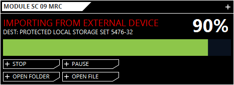

# Downloader
<p align="justify">
This is a application for downloading file for external links. This application using multitheaded download to accelerate downloading speed.
</p>

## Technologies
* Java 8
* JavaFX 
* [JFeonix](http://www.jfoenix.com/) - JavaFX Material Design Library
* [FontAwesomeFX](https://www.jensd.de/wordpress/) - Font Icon for JavaFX 
* [AnimateFX](https://typhon0.github.io/AnimateFX/) - Animations for JavaFX
* [Multithreaded Downloader Manager Java](https://github.com/kunal52/Multithreaded_Downloader_Manager_Java) - Multitheaded Downloader


## Build With
* [Maven](https://maven.apache.org/) - Dependency Management

## Installing

Run project via terminal 
```
cd ../Downloader

mvn clean compile exec:java
```

Execute .jar file
```
cd ../Downloader/target

java -jar Downloader-1.0.jar
```

## Screenshot
<p align="center">
  
</p>

<p align="center">
  
</p>

## Authors
* **Rasio Ganang Atmaja**

## Task List
- Add action listernet for stop, pause, open file, and open folder
